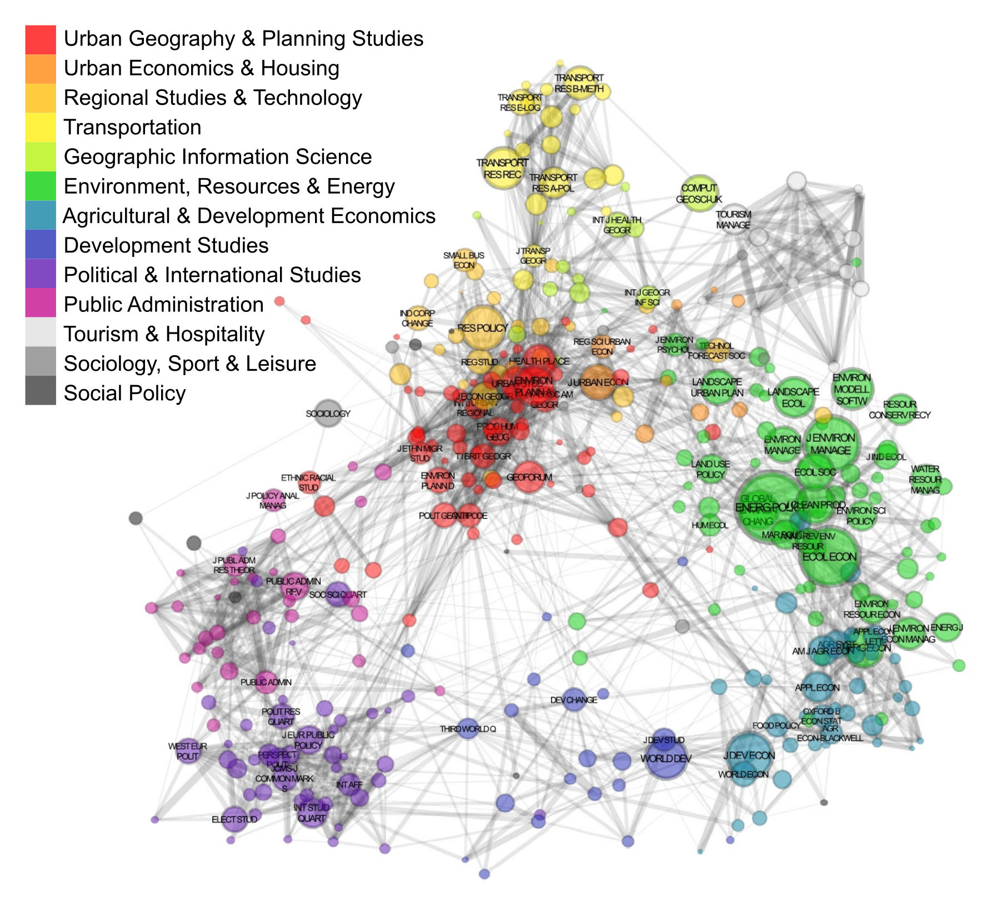

## Summary

Mapping of Science is the application of powerful statistical tools and analytical techniques to uncover the structure or development of science based on the relations between specific entities or units. The academic journals form a network of scientific articles, connected by citations. Each citation in this network reflects the assessment of an individual scholar regarding which papers are interesting and relevant to his/her research. Journals are a unit of analysis that allows one to understand how science is organized at an aggregated level.

Urban studies is one of the longest established interdisciplinary field within the modern academy. Urban Studies is changing and being changed as its subfields develop and new related fields arise. Innovative academic and entrepreneurial relations depend upon complex systems of communications. The aim of this research is to provide a platform of integration and reference in this interdisciplinary discourse, and to maintain an analytic and synthetic record of the broader arrangements of the academic communication.

Unsupervised learning and network analytic approach were performed in order to compute and visualize clusters and interactively explore the results across the various approaches. The best results, in terms of modularity (clustering quality function), gives SCPS, an implementation of the spectral clustering algorithm. Scientific landscape was visualized using the spring-embedded layout, as the most widely used method for arranging general two-dimensional graphs.

## Map

